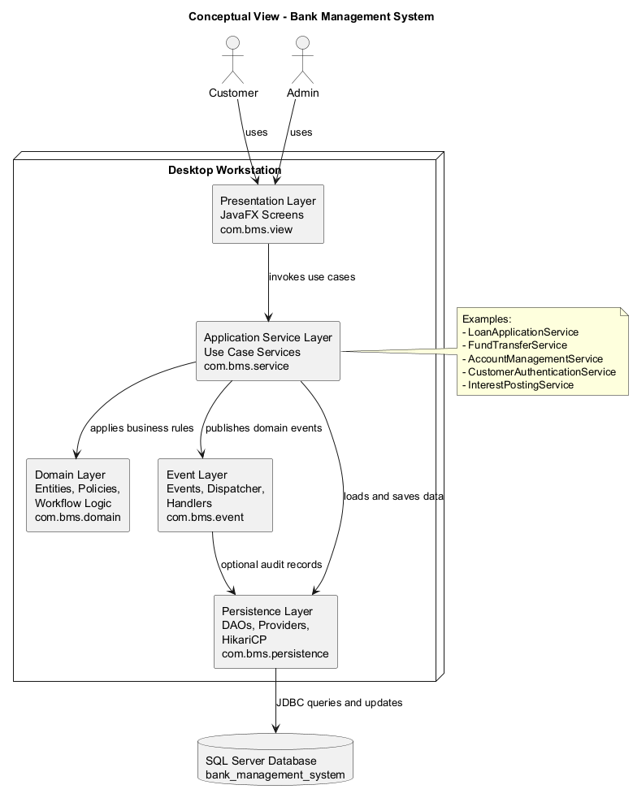
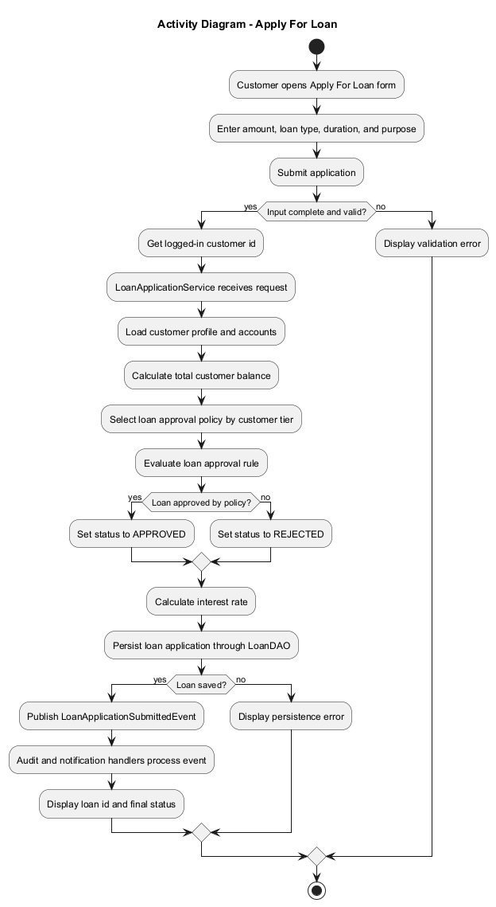
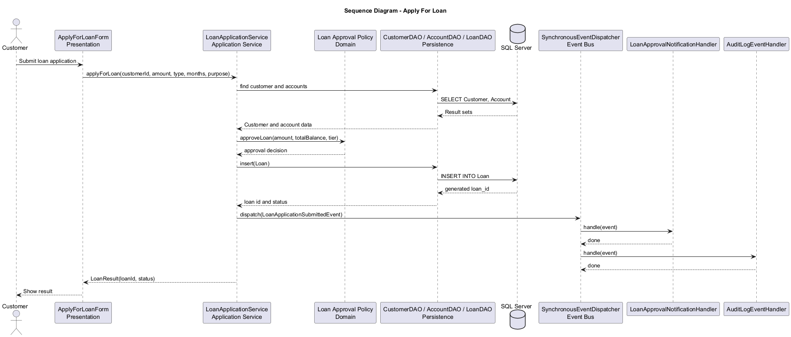
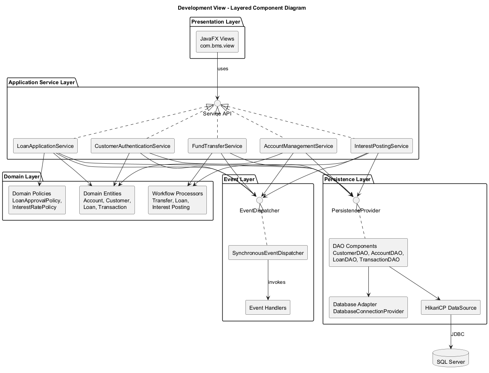
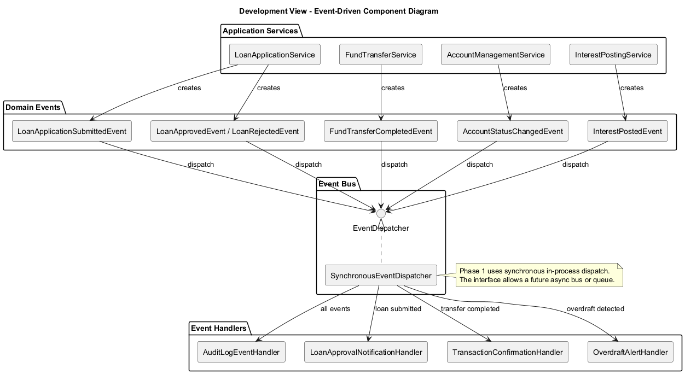
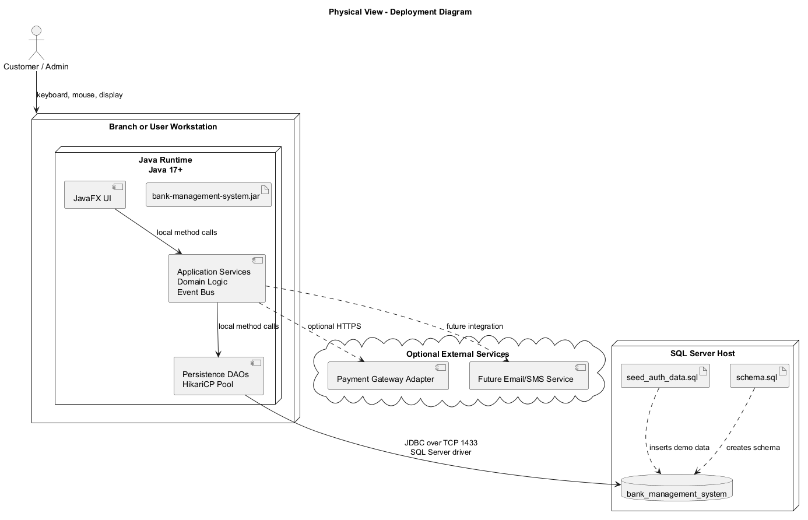
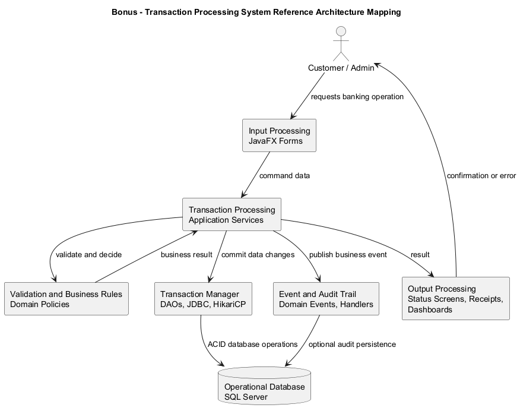

# 1. Introduction

The Bank Management System is a JavaFX desktop application for retail banking operations. It supports customer workflows such as login, account selection, account balance viewing, transaction history, fund transfers, loan applications, and loan status tracking. It also supports administrator and teller workflows such as customer profile creation, deposits, withdrawals, account status updates, loan review, monthly interest posting, and overdraft alert monitoring.

The system uses Java 17, JavaFX, Maven, JDBC, HikariCP, and Microsoft SQL Server. The architecture is designed for a single desktop application connected to a central relational database. The main architectural goal is to keep the user interface, business workflow orchestration, domain rules, events, and database access separated so that the project remains maintainable, testable, and extensible.

# 2. Architectural Design and Justification

## 2.1 Selected Architectural Styles

The system integrates three complementary architectural styles:

1. Layered Architecture
2. Event-Driven Architecture
3. Repository/DAO Architecture as the persistence style inside the layered design

The two primary styles are Layered Architecture and Event-Driven Architecture. Repository/DAO supports the layered style by isolating SQL and JDBC operations behind persistence components.

## 2.2 Layered Architecture

The system is organized into the following layers:

| Layer | Main Packages | Responsibility |
| --- | --- | --- |
| Presentation Layer | `com.bms.view` | JavaFX screens, forms, navigation, and user input handling |
| Application Service Layer | `com.bms.service` | Use-case orchestration, coordination between domain and persistence, event emission |
| Domain Layer | `com.bms.domain.entity`, `com.bms.domain.controller` | Business entities, policies, rules, and reusable workflow logic |
| Event Layer | `com.bms.event`, `com.bms.event.bus`, `com.bms.event.handler` | Domain events, synchronous dispatcher, and event handlers |
| Persistence Layer | `com.bms.persistence` | DAOs, persistence factory, database adapter selection, connection pool |
| Database Layer | SQL Server | Stores customers, accounts, transactions, transfers, loans, interest postings, and overdraft events |

The service layer is the main architectural refinement. The UI no longer needs to coordinate complex workflows directly. Instead, JavaFX screens call application services such as `LoanApplicationService`, `FundTransferService`, `AccountManagementService`, `InterestPostingService`, and `CustomerAuthenticationService`.

### Suitability

Layered Architecture is suitable because the application has clear responsibility areas:

- UI rendering and input capture are presentation concerns.
- Banking use cases are application-service concerns.
- Loan approval, interest calculation, account validation, and transaction rules are domain concerns.
- SQL and connection management are persistence concerns.

This separation is especially useful for a banking system because business rules change independently from UI layout and database implementation details.

### Support for Requirements

Layering supports the functional requirements by giving each use case a clear place:

- Login and role routing are handled through authentication services.
- Fund transfers are coordinated through a transfer service and persisted through DAOs.
- Loan submission and review are coordinated through a loan service.
- Monthly interest posting is coordinated through an interest posting service.
- Admin account-management actions are coordinated through an account-management service.

It also supports maintainability because changes to one layer usually do not require changes to unrelated layers.

## 2.3 Event-Driven Architecture

The system includes a synchronous event dispatcher in `com.bms.event.bus`. Application services publish domain events after successful state-changing operations. Event handlers react to these events independently.

Important events include:

| Event | Meaning |
| --- | --- |
| `LoanApplicationSubmittedEvent` | A customer submitted a loan application |
| `LoanApprovedEvent` | An administrator approved a loan |
| `LoanRejectedEvent` | An administrator rejected a loan |
| `FundTransferCompletedEvent` | A transfer completed successfully |
| `FundTransferFailedEvent` | A transfer failed validation or processing |
| `CustomerProfileCreatedEvent` | A new customer profile was created |
| `AccountStatusChangedEvent` | An account was activated, frozen, or closed |
| `InterestPostedEvent` | Monthly interest posting completed |
| `OverdraftDetectedEvent` | An account overdraft was detected |

The current implementation uses `SynchronousEventDispatcher`, which keeps the design simple and predictable. Future versions could replace the dispatcher with an asynchronous event bus or message broker without changing the service APIs.

### Suitability

Event-Driven Architecture is suitable because many banking workflows require secondary actions after the main transaction:

- Notify administrators about new loan applications.
- Log audit records after state-changing operations.
- Send transfer confirmations.
- Raise overdraft alerts.
- Add future email, SMS, or reporting integrations.

Without events, each service would need to call every secondary component directly. Events avoid that tight coupling.

## 2.4 Repository/DAO Architecture

The persistence layer uses DAOs and a `PersistenceProvider` abstraction. SQL access is centralized in classes such as `CustomerDAO`, `AccountDAO`, `LoanDAO`, `TransactionDAO`, `TransferDAO`, `InterestPostingDAO`, and `OverdraftEventDAO`.

The system also includes database adapter infrastructure through `DatabaseConnectionProvider`, `DatabaseConnectionProviderSelector`, and concrete providers such as `SqlServerConnectionProvider`.

### Suitability

Repository/DAO is suitable because the system uses a relational database and many workflows depend on reliable CRUD and query operations. This style keeps JDBC, SQL statements, result-set mapping, and connection details out of the UI and service layer.

## 2.5 How the Architectural Styles Complement Each Other

Layered Architecture defines where responsibilities belong. Event-Driven Architecture defines how secondary behavior is triggered without creating direct dependencies. Repository/DAO isolates persistent storage.

Example: customer applies for a loan.

1. The JavaFX form captures the application data.
2. The presentation layer calls `LoanApplicationService`.
3. The service coordinates domain rules and persistence.
4. The persistence layer stores the loan in SQL Server.
5. The service publishes `LoanApplicationSubmittedEvent`.
6. Event handlers handle audit logging and notifications independently.

Together, the styles provide a system that is structured, extensible, and easier to test.

## 2.6 Key Architectural Decisions

| Decision | Justification |
| --- | --- |
| Use a desktop JavaFX client | Matches the branch/desktop banking scenario and course project scope |
| Use Layered Architecture | Gives clear separation between UI, services, domain logic, persistence, and database |
| Add an Application Service Layer | Prevents UI classes from orchestrating business workflows directly |
| Use a synchronous event dispatcher first | Keeps the event flow simple, deterministic, and easy to test |
| Use SQL Server with JDBC and HikariCP | Provides durable relational storage and efficient connection pooling |
| Avoid Microservices | The system is a single desktop application; microservices would add unnecessary deployment and communication complexity |

# 3. Non-Functional Requirements

The architecture affects the following non-functional requirements.

| NFR | Architectural Support |
| --- | --- |
| Maintainability | Layers separate UI, service orchestration, domain rules, events, and persistence. Each concern can evolve independently. |
| Extensibility | New use cases can be added as new services. New reactions can be added as event handlers without modifying existing services. |
| Testability | Services can be tested with mocked persistence providers and event dispatchers. Domain rules can be tested without JavaFX. |
| Performance | HikariCP reuses database connections. The event bus is in-process and synchronous, avoiding network overhead for local event handling. |
| Security | Authentication is centralized through the authentication service and `AuthContext`. Role-based routing separates customer and administrator workflows. |
| Reliability | DAOs use prepared statements and centralize database access. Event handlers catch failures so secondary actions do not break main workflows. |
| Availability | The application can continue running as long as the desktop client and SQL Server are available. The simple deployment reduces moving parts. |
| Scalability | The current design supports vertical scaling for the database and a future migration from synchronous local events to asynchronous message queues. |
| Auditability | Domain events provide a natural place to attach audit logging for compliance-related actions. |
| Portability | The persistence adapter abstraction leaves room for other database providers, even though SQL Server is the supported runtime backend. |

# 4. Conceptual View: Block Diagram

The conceptual view shows the main subsystems and their relationships at a high level. Users interact with JavaFX screens. The UI calls application services. Services coordinate domain rules, persistence operations, and event publishing. DAOs communicate with SQL Server through JDBC and HikariCP.

{width=100%}

# 5. Process View: Dynamic Behavior

The process view uses the representative scenario "Customer applies for a loan." This use case is representative because it touches the presentation layer, application service layer, domain rules, persistence layer, database, event bus, and event handlers.

## 5.1 Activity Diagram

The activity diagram shows the workflow from user input validation through persistence and event publication.

{width=100%}

## 5.2 Sequence Diagram

The sequence diagram shows runtime interaction between the JavaFX form, application service, domain policy, DAOs, SQL Server, event dispatcher, and event handlers.

{width=100%}

# 6. Development View: Component Diagrams

The development view shows the main software components and interfaces.

## 6.1 Layered Component Diagram

The layered component diagram emphasizes compile-time and logical dependencies between packages. The presentation layer depends on service APIs. Services depend on domain rules, persistence interfaces, and event dispatcher interfaces. Persistence depends on SQL Server and JDBC infrastructure.

{width=100%}

## 6.2 Event-Driven Component Diagram

The event-driven component diagram focuses on how services publish events and how independent handlers subscribe to those events.

{width=100%}

# 7. Physical View: Deployment Diagram

The deployment view shows where the software components run. The desktop client runs on a branch or user workstation. SQL Server may run locally for development or on a separate database server for shared use. Communication between the application and database uses JDBC over TCP.

{width=100%}

# 8. Bonus: Reference Architecture

The Bank Management System maps closely to a Transaction Processing System reference architecture.

A transaction processing system accepts user requests, validates them, applies business rules, updates a durable database, records transaction history, and returns a result. This is exactly how banking workflows such as transfers, deposits, withdrawals, loan applications, and interest posting behave.

The mapping is:

| Reference Architecture Element | Bank Management System Mapping |
| --- | --- |
| Input processing | JavaFX forms and screens |
| Transaction processing | Application services such as `FundTransferService` and `LoanApplicationService` |
| Validation and business rules | Domain entities, policies, and workflow processors |
| Transaction manager/data access | Persistence providers, DAOs, JDBC, HikariCP |
| Operational database | SQL Server `bank_management_system` database |
| Audit/output | Domain events, handlers, status screens, transaction history |

{width=100%}

# 9. Consistency With Implementation

The architecture is reflected in the current codebase:

- `com.bms.view` contains JavaFX presentation classes.
- `com.bms.service` contains application services introduced for the service layer.
- `com.bms.event`, `com.bms.event.bus`, and `com.bms.event.handler` contain event infrastructure.
- `com.bms.domain` contains entities, policies, and reusable business workflow logic.
- `com.bms.persistence` contains DAOs, persistence providers, connection providers, and datasource setup.
- `src/main/resources/db/schema.sql` defines the SQL Server database schema.

The most important implemented service-layer classes are:

- `CustomerAuthenticationService`
- `AccountManagementService`
- `LoanApplicationService`
- `FundTransferService`
- `InterestPostingService`

The most important implemented event infrastructure classes are:

- `DomainEvent`
- `EventDispatcher`
- `EventHandler`
- `SynchronousEventDispatcher`
- `EventHandlerRegistry`

# 10. Submitted UML Model Files

The original diagram model files are stored under:

`docs/deliverable4/uml`

| Diagram | Model File |
| --- | --- |
| Conceptual block diagram | `01-conceptual-view.puml` |
| Activity diagram | `02-loan-application-activity.puml` |
| Sequence diagram | `03-loan-application-sequence.puml` |
| Layered component diagram | `04-layered-component-view.puml` |
| Event-driven component diagram | `05-event-driven-component-view.puml` |
| Deployment diagram | `06-deployment-view.puml` |
| Bonus reference architecture diagram | `07-bonus-transaction-processing-reference.puml` |

These files are PlantUML model files and can be rendered using a PlantUML plugin, PlantUML desktop integration, or the PlantUML command-line tool.

# 11. Conclusion

The proposed architecture combines Layered Architecture, Event-Driven Architecture, and Repository/DAO persistence. Layering provides clear system structure and separation of concerns. Events provide extensibility for audit, notification, and future integrations. DAOs provide controlled database access and isolate SQL Server details.

This architecture satisfies the system requirements while supporting maintainability, testability, extensibility, performance, reliability, and future scalability.
